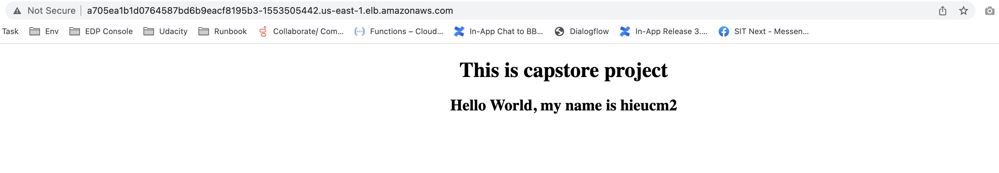

# Capstone Project

This is my repository: https://github.com/hieuCM2895/project5

This is the capstone project for the Udacity Cloud DevOps Engineer Nanodegree program. The project involves building, linting, and deploying an application using various tools and technologies.
In this project I apply the skills and knowledge which were developed throughout the Cloud DevOps Nanodegree program. These include:

- Working in AWS
- Circle CI to implement Continuous Integration and Continuous Deployment
- Building pipelines
- Working CloudFormation to deploy clusters
- Building Kubernetes clusters - Elastic Kubernetes Service
- Building Docker containers in pipelines

## Application

The Application is based on a python3 script using flask render_template to render a simple html in browser.

## Project Structure

The project repository has the following structure:

- contain the Elastic Kubernetes Service file
- create the Elastic Kubernetes Service
- contain the html file
- create the Elastic Kubernetes Service
- deploy the application
- builde the application Docker image

## Access the Application

Public LB DNS: http://a705ea1b1d0764587bd6b9eacf8195b3-1553505442.us-east-1.elb.amazonaws.com/

